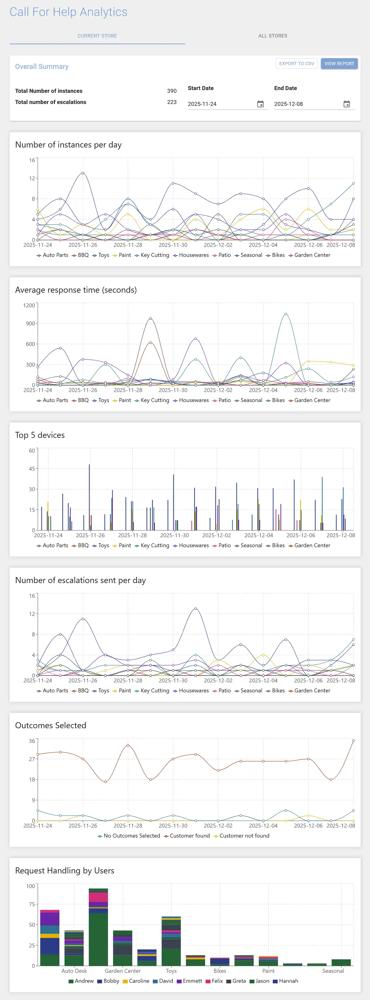

The Call for Help Dashboard allows you to view and analyze the key metrics of your call buttons and displays to gain valuable insights into how your customers request help and how your staff respond to those requests.

### Access the Dashboard
1. Sign into __MyStore__ as a Location Administrator
2. Select __Call for Help__
3. Select __Dashboard__

### Overall Summary
The Overall Summary provides a snapshot of essential metrics related to your Call for Help operations:
- __Total Number of instances:__ The total number of help requests.
- __Total number of escalations:__ The total number of help requests that were escalated.

### Generate a Report
1. Within the Overall Summary box, locate the date selection boxes labeled "Start Date" and "End Date."
2. Select the desired start date and end date to define the date range for your report. Ensure the date range does not exceed 31 days.
3. Once you've selected the date range, the metrics will automatically update to reflect data specific to that range.

### Interpret the Data
- __Number of instances per day:__ Identify number of help requests each button receives.
- __Average response time:__ How long does it take your staff to respond to each button.
- __Top 5 devices:__ These are your most active buttons each day.
- __Number of escalations sent per day:__ Identify which buttons have the most escalations.
- __Outcomes Selected:__ Identify customer engagement and sales impact of help requests.
- __Request Handling by Users:__ Identify which staff members respond to which help requests. 

### Example Report

### Export Report Data
The raw data used in the report can be exported to CSV to use with other analytics tools.

To export the raw data click the __EXPORT TO CSV__ button.
