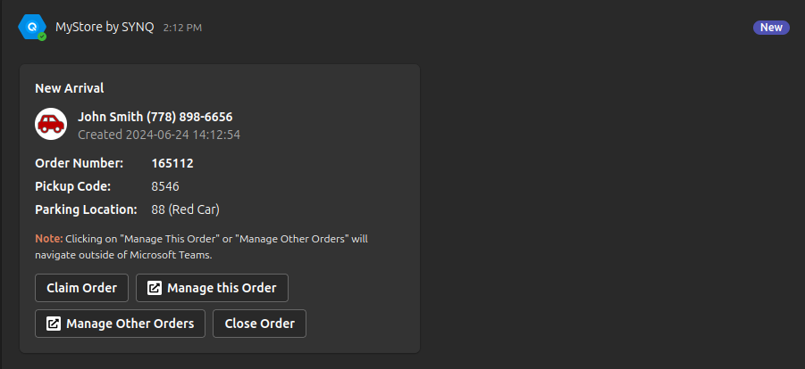
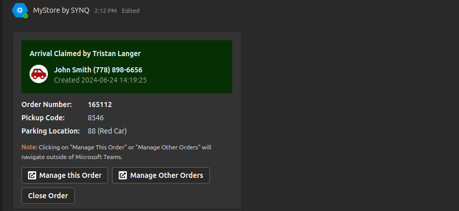
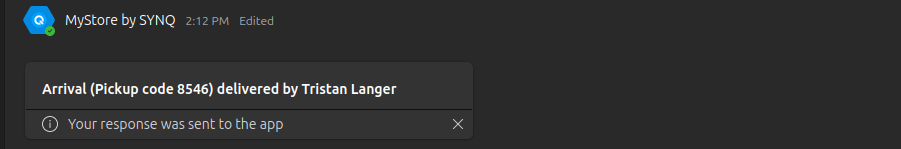
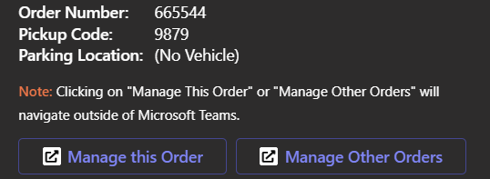
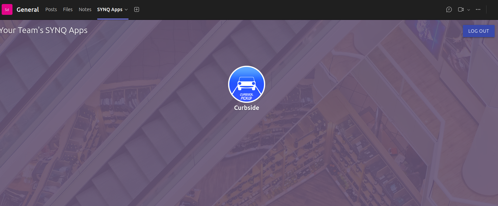
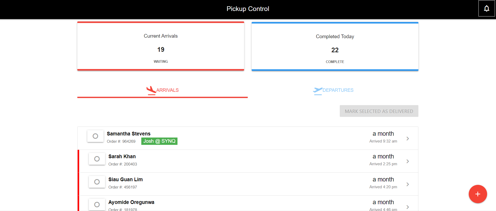
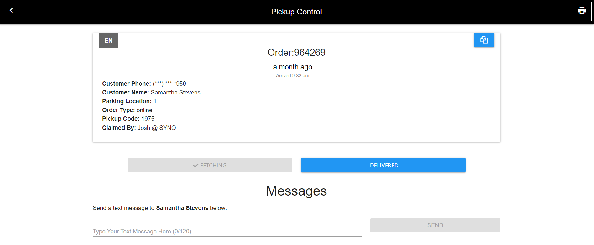
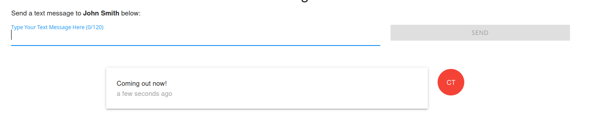
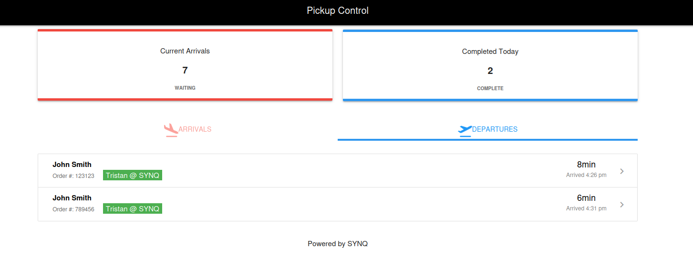
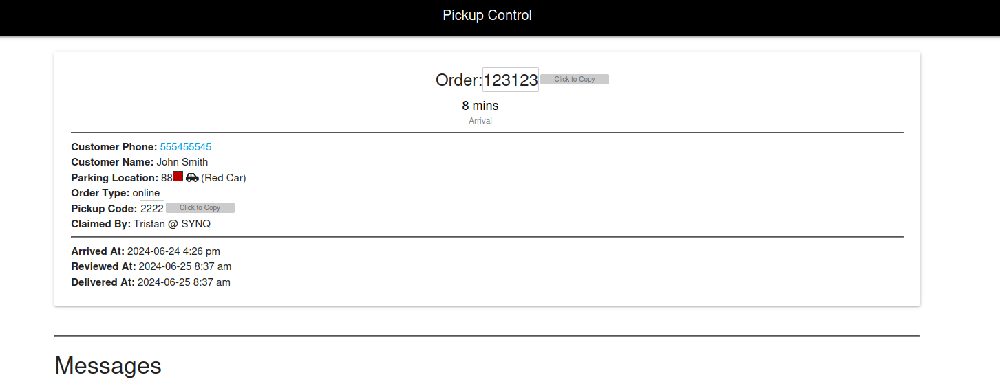

# Introduction
Curbside pickup has experienced explosive growth in the wake of Covid-19, yet the need for process optimization has been largely overlooked.

At SYNQ, we have digitized curbside, providing customers with the digital experience they expect and enabling organizations to streamline their operations while harnessing and leveraging valuable data points.

## Prerequisites

Before you start using the Curbside Pickup Application, ensure that you meet the following requirements:
- Microsoft Teams Account/Subscription: To setup the relevant teams and channels for your store you must have a Teams account with your organization.
- An Active Subscription with SYNQ: In order to use Curbside you must first purchase a subscription with SYNQ. To purchase please contact us [here](https://www.synqtech.com/contact). 
- Microsoft account linked to SYNQ: Your organization should automatically link your account to the SYNQ portal. If not please contact our support team at helpdesk@synqtech.com.

## Team and Channel Configuration
1. Create a Team
   1. In Microsoft Teams, create a new team specifically for your store. 
   2. Name it appropriately, such as "[Store Name] Curbside Pickup Team."
2. Create Channels: Within the newly created team, set up three channels:
  - "Curbside": This channel will be used to receive curbside pickup orders when customers arrive.
  - "Curbside Notification": This channel to ensure no orders go missed.
  - "Curbside Managers": This channel is used to indicate to store managers and supervisors that an order is currently stale, and it needs to be addressed immediately.

## Associate Experience
In this section, you will get a hands-on walk through of the application's key features, components, and functionalities. 

### Microsoft Teams Notifications

#### Arrival Notification
When a new pickup request is received, an adaptive card notification is sent to the designated Microsoft Teams channel. This card includes vital details such as the customer's order number, arrival time, pickup code, and parking location.

#### Claim Notification
When an employee claims the order, the original card is updated with the employee who claimed it. 

#### Delivery Notification
After an employee closes the order or marks it as delivered the card is updated and closed.

### Accessing the SYNQ Dashboard

#### Dashboard Navigation
Clicking on the "Manage this Order" button within the adaptive card redirects you to the SYNQ Curbside Dashboard.

#### Accessing from SYNQ apps
If you click on the SYNQ apps tab it will open up the available SYNQ applications your organization has installed. 

:::note
This is only available on teams where SYNQ Frontline Hero has been installed. 
:::

### Pickup Control Overview

#### Pickup Requests Section
In the SYNQ Dashboard, navigate to the "Arrivals" section to view a list of incoming requests. Click on each request to access detailed information.

#### Order Details
Upon clicking a specific request, you'll have access to comprehensive order details, including customer information, items, and any special instructions.

#### Messaging Customers
Employees are able to send messages to customers through the order to notify of any delays or updates. 

:::note
This requires a Twilio API key and phone number applied to your store's Location Settings. A Twilio API key can also be applied in Organization Settings to cover all stores in the Organization. See [Phone Number Requirements](/docs/mystore/twilio#phone-number-requirements) for requirements and configuration details. 
:::

#### Departures
All previous orders can been seen from the departures tab. Clicking on an order will reveal additional details. 

