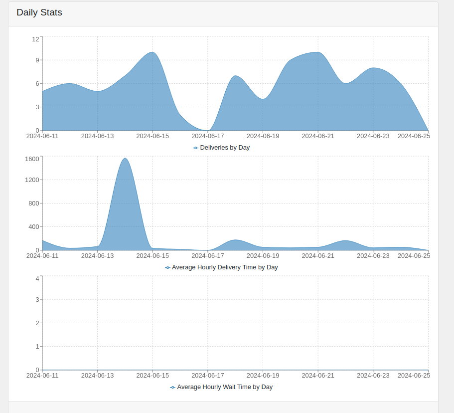
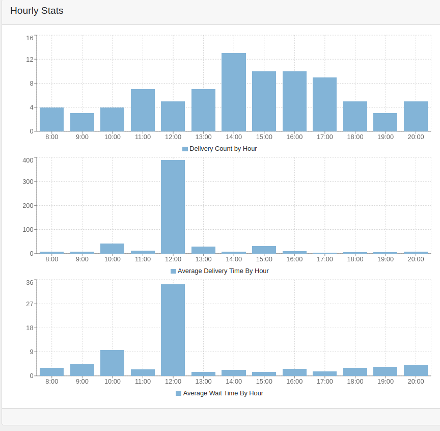
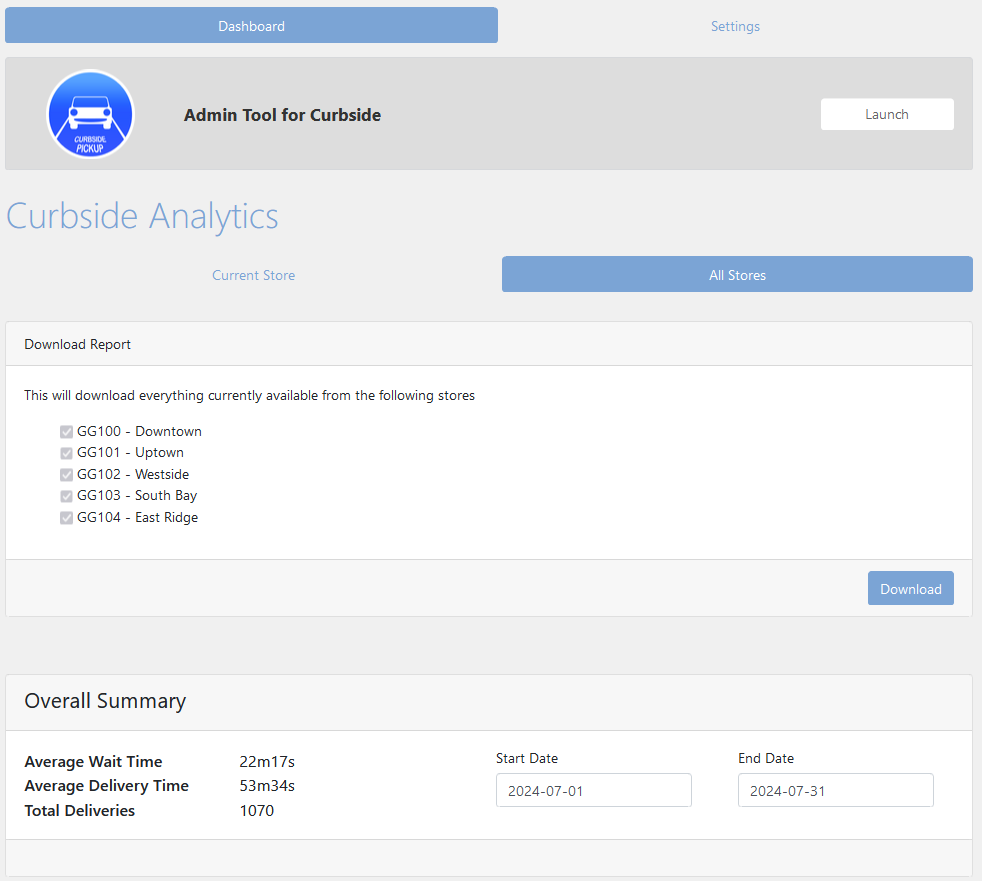
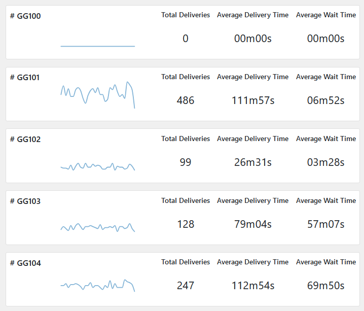

The Curbside Dashboard allows you to generate reports based on your Curbside Pickup data
and analyze the key metrics to gain valuable insights into your operations.

### Overall Summary
The Overall Summary provides a snapshot of essential metrics related to your Curbside Pickup operations:
- __Average Wait Time:__ The average amount of time customers spend waiting for their orders.
- __Average Delivery Time:__ The average time taken to fulfill and deliver orders.
- __Current Open Arrivals:__ The number of customers currently awaiting service.
- __Total Deliveries:__ The cumulative count of completed deliveries.

### Generate a Report
1. Within the Overall Summary box, locate the date selection boxes labeled "Start Date" and "End Date."
2. Select the desired start date and end date to define the date range for your report. Ensure the date range does not exceed 31 days.
3. Once you've selected the date range, the metrics in the Overall Summary box will automatically update to reflect data specific to that range.

### Interpret the Data
- __Average Wait Time and Average Delivery Time:__ Use these metrics to assess the efficiency of your service. Lowering wait times and delivery times can improve customer satisfaction.
- __Current Open Arrivals:__ Monitor this metric in real-time to allocate resources effectively and ensure timely service.
- __Total Deliveries:__ Keep track of the total number of deliveries over time to analyze trends and	plan for future demand.
By generating reports based on your selected date range, you can analyze trends and track performance metrics to make data-driven decisions.

### Example Store Reports
#### Daily

#### Hourly

#### Downloading Reports
To view summaries for all stores navigate to the all stores tab under Curbside Analytics. This will give an overview into all stores data.  

To download report for all stores click the download button, this will download a .csv containing all orders for the selected time frame and stores. 

#### Store Summaries
Further down the page you will find summaries of all selected stores from your organization over the selected period. 
