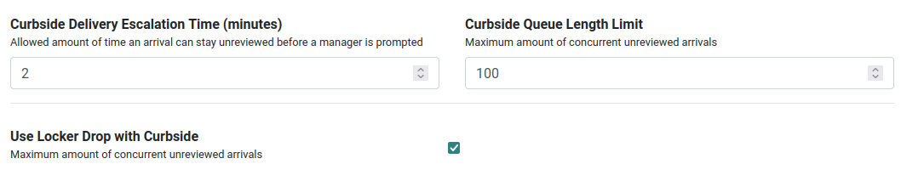
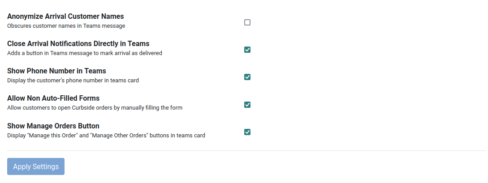
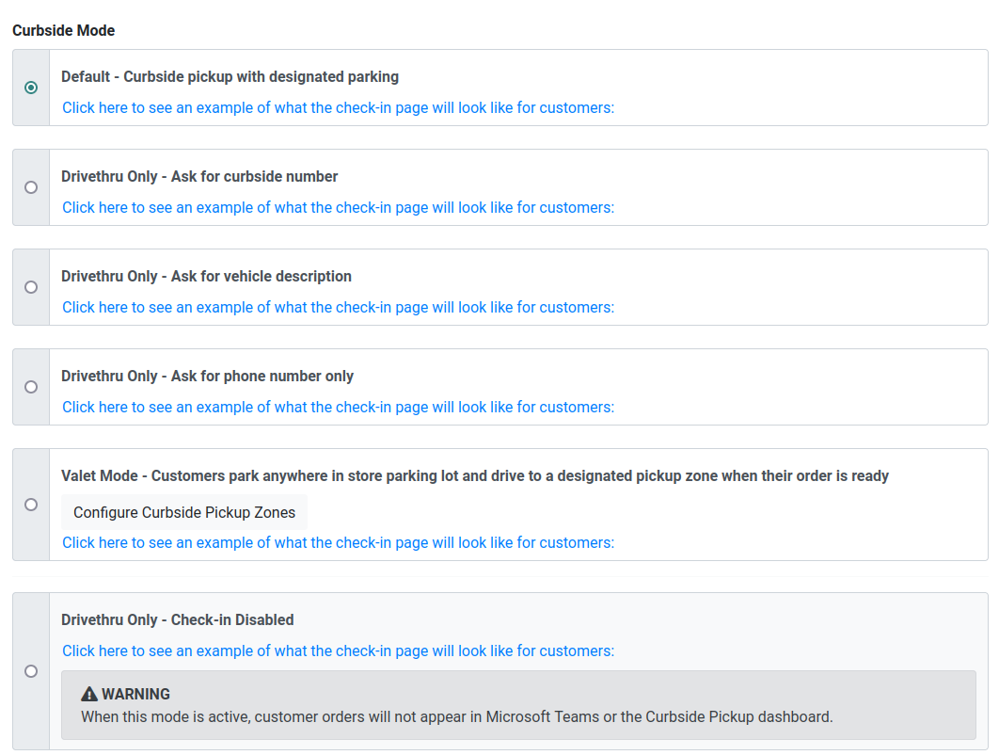
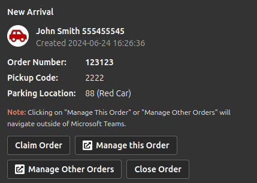
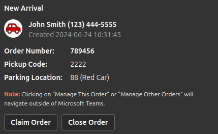
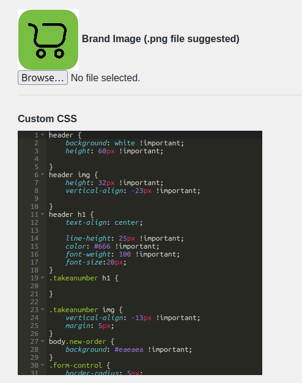

# Settings
Curbside settings can be found [here](https://dcio.synqtech.com/admin/curbside/settings). From these pages you can configure curbside to your stores specifications.

 \

### Curbside Bot Channel
This is the channel that notifications should be delivered to when there is a Curbside arrival.

### Curbside Mode
Stores manage curbside pickups in a variety of ways. The Curbside Mode allows you to selects the pickup mechanism that best suits your store. The selected mode determines the instructions and questions presented to the customer. Select from:
- Default - Curbside pickup with designated parking 
- Drivethru Only - Ask for curbside number 
- Drivethru Only - Ask for vehicle description 
- Drivethru Only - Ask for phone number only
- Valet Mode - Customers park anywhere in store parking lot and drive to a designated pickup zone when their order is ready 
- Drivethru Only - Check-in Disabled

:::tip
You can click on the link on each mode to see an example of the customer check-in page.
:::

### Curbside Delivery Escalation Time
The amount of time (in minutes) that a curbside arrival must be reviewed within. If this limit is exceeded an escalation alert is triggered.

### Curbside Queue Length Limit
To ensure staff are not flooded with an unlimited number of concurrent curbside check-ins, there is limit on how many new arrivals will be accepted at a given time. If this limit is reached, customers that attempt to check in will see a message that the curbside pickup queue is currently full and to try again in a few minutes.

### Use Locker Drop with Curbside
Enables the option to use locker drop-off as an alternative to direct curbside delivery for customer orders. See the locker guide for further information.

### Close Arrival Notifications Directly in Teams
Allows team members to close or acknowledge customer arrival notifications directly within the Microsoft Teams platform.

### Anonymize Arrival Customer Names
Masks customer names in arrival notifications to protect customer privacy.

### Show Phone Number in Teams
Displays the customer's phone number in arrival notifications and other relevant areas within Microsoft Teams.

### Allow Non Auto-Filled Forms
Permits the use of forms that require manual input rather than being automatically filled with customer or order information from the email they receive.

### Show Manage Orders Button
Displays a button that provides access to manage and view customer orders in the Curbside management portal on the teams card.
 \

### Deep Links
When deep links are enabled the Mystore portal can be accessed from within Microsoft teams. This can be useful if your organization has disabled browsers on employee devices as it allows a browser to run within teams.  

## Branding and Logo Customization
### Add Your Store's Logo
Personalize the Curbside Pickup Application by incorporating your store's logo. This logo will be prominently displayed on the MyStore by SYNQ, reinforcing your brand identity.

### Custom Color Schemes
Tailor the application's color schemes to align with your brand's visual identity. Choose colors that resonate with your store's image, creating a cohesive and recognizable look that can be used with customer communications.

Using the custom CSS panel you can define colors for your organization to customize the customer pickup form. In future versions this will be simplified. 