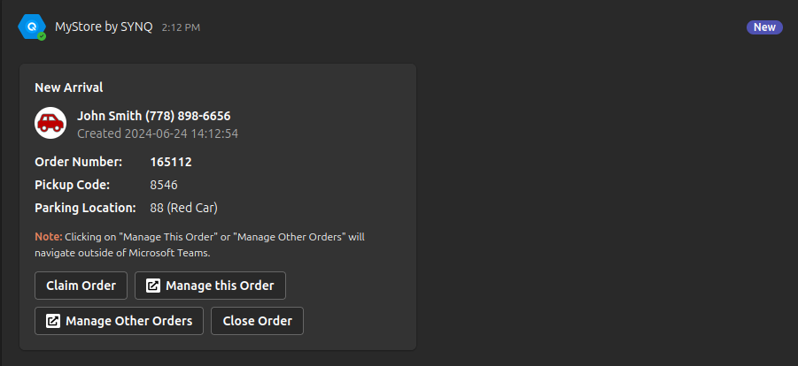
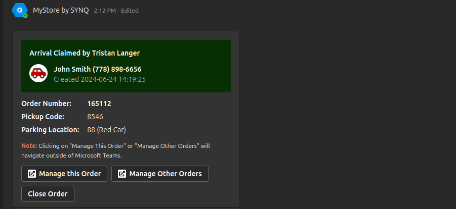
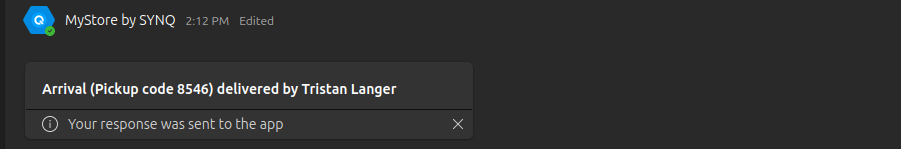

In this section, we'll walk you through common workflows within the Curbside Pickup Application. These step-by-step guides provide a comprehensive overview of how to effectively use the application to manage orders, communicate with customers, and optimize curbside pickup operations.

### Placing Orders
When a customer places an order for curbside pickup they receive an email containing a confirmation of their order and a link that will send an arrival notification when clicked. Orders are usually auto completed by a special URL the customer clicks in their email. 

### Managing Orders
1. Access the "Orders" section to view a list of all orders.
2. Click on an order to view details, update status, or communicate with the customer.
3. Use the provided options to change order status (e.g., "Claimed", "Delivered").

### Communicating With Customers
Messaging Customers: Employees are able to send messages to customers through the order to notify of any delays or updates. 

### Repeating Alerts
Repeating alerts settings can be managed under the curbside settings tab. When this feature is enabled if an order goes unclaimed for longer than one minute alerts will be sent with a link to the order to the relevant channel. Escalation alerts can be enabled as well which follow the same functionality.

### Notifications in the Teams channel

A new order has arrived in the channel.

The order has gone unclaimed for over 1 minute, the unclaimed alert gets sent to the channel.

The order gets claimed, the unclaimed notifications stop.

The order goes undelivered for over a minute, Undelivered notifications start sending.

The order gets delivered and notifications stop, the delivered notification gets sent.
