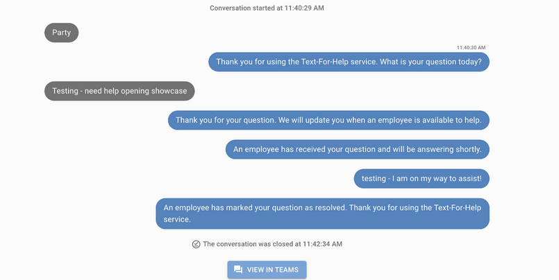

# Introduction
Text for Help enables customers to interact with your business via text messaging. Customers text a keyword to a phone number displayed on in-store signage. Associates receive notifications and manage requests seamlessly through Microsoft Teams.

Text for Help provides data insights, reduces wait times, promotes employee accountability, saves labour costs, improves efficiency, and enhances customer satisfaction.

## Requirements
You need a Twilio account and phone number to use Text for Help. See [Phone Number Requirements](/docs/mystore/twilio#phone-number-requirements) for requirements and configuration details.

## Microsoft Teams Setup
Text for Help relies on the customer texting a "keyword" or phrase to your Text for Help number. Each keyword can be assigned to a specific Teams channel so that you can direct requests to the most appropriate associates.

### Create Channels
To get started you'll need to create (or select) a Team for Text for Help and create the necessary channels within it. 
See [Create Teams and Channels](/docs/getting-started/microsoft-teams#create-teams-and-channels) for instructions on how to create teams and channels and add users to those teams. 
:::tip
We recommend having a dedicated channel for each Text for Help keyword. 
:::

#### Example Keywords and Teams Channels
| Keyword | Teams Channel |
|---------|---------------|
| HELP | Text for Help – General |
| AUTO | Text for Help – Automotive |
| PARTY | Text for Help – Party City |
| SEASONAL | Text for Help – Seasonal |
| GARDEN | Text for Help – Garden Center |
| SPORTS | Text for Help – Sports |

:::note
This is a standard setup only, your store has the flexibility to choose to add, remove, or edit keywords and channels as needed. 
:::

### Enable Notifications
See [Enabling/Disabling Notifications](/docs/getting-started/microsoft-teams#enablingdisabling-notifications) for instructions on how to ensure that notifications are enabled on your devices.

## Customer Experience
1. A customer is standing in an aisle and needs assistance.
2. The customer sees the Text for Help signage that says "Need assistance? Text 'HELP' to (234) 567-8900".
3. The customer texts the keyword `HELP` to the phone number.
4. The customer receives a text reply prompting them to ask their question.
5. The customer asks a question about the availability of a product.
6. The customer receives a text reply to their question from an associate.
7. The customer may chat with the associate and ask follow up questions via text until they have been helped.
8. The customer receives a final message the their Text for Help request has been marked resolved.

## Associate Experience
1. The associate receives a Text for Help notification/alert on their device in Microsoft Teams.
2. The associate can see information about the Text for Help request
   - What keyword the customer used.
   - The customer's question.
3. The associate clicks the __Claim__ button to indicate that they will handle this request.
   - All other store associates on the same team are able to see that this request has been claimed.
4. The associate may need a moment to wrap up their current task.
5. When ready, the associate replies to the customer in Microsoft Teams.
6. The associate may continue to chat with the customer via Microsoft Teams until the required help has been delivered.
7. The associate marks the Text for Help request as complete in Microsoft Teams.

## Text for Help Admin Tool
The Text for Help Admin Tool provides a historical view of all your store's Text for Help conversations.

Clicking into a conversation will provide a complete conversation history along with information about the Text for Help request.

