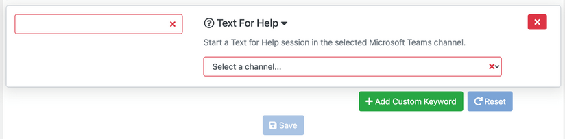
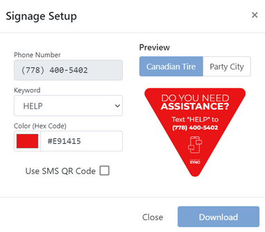
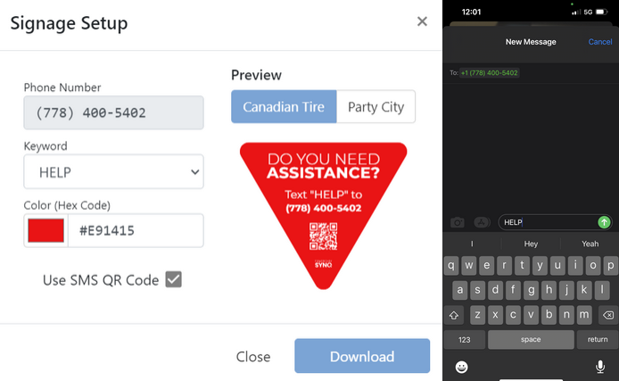

# Settings

## Configure a Twilio number
  - See [Phone Number Requirements](/docs/mystore/twilio#phone-number-requirements) for requirements and configuration details.

## Keywords
Text for Help relies on the customer texting a "keyword" or phrase to your Text for Help number. Each keyword can be assigned to a specific Teams channel so that you can direct requests to the most appropriate associates.

To configure the keywords and what channels they get assigned to:
1. Sign into __MyStore__ as a Location Administrator
2. Select __Text for Help__
3. Select __Settings__
4. Scroll down to __Settings__
5. Each keyword allows you to select the Teams channel to use for its notifications

### Default Keywords
The following keywords `HELP`, `HELPME`, and `HELP ME` are system defaults. 

### Configure Custom Keywords
You can create your own custom keywords and assign them to an appropriate channel.
1. Sign into __MyStore__ as a Location Administrator.
2. Select __Text for Help__.
3. Select __Settings__.
4. Click __Add Custom Keyword__. \
   
5. Provide the desired keyword.
   :::note
   Keywords are case-insensitive.
   :::
6. Select the desired Teams channel that will receive the notifications.
7. Click __Save__.
:::tip
Good keywords are short and easy for your customer to type on their mobile device. For example, prefer `PAINT` over `PAINT DEPARTMENT`.
:::

## Download Signage
You'll want to deploy some signage throughout your store to inform customers of the Text for Help system.

To download pregenerated signage for your Text for Help keywords:
1. Sign into __MyStore__ as a Location Administrator.
2. Select __Text for Help__.
3. Select __Settings__.
4. Scroll down to the desired keyword.
5. Click the __↓ Download Signage__ button. \
   
6. Select the desired color.
7. Check the __Use SMS QR Code__ checkbox if you want the signage to include a QR code that will populate a text message on the customer's smart phone. \
   
    :::tip
    SMS QR codes will pre-populate the customer's text messaging app with the correct phone number and keyword message. This helps avoid typing mistakes.

    Please note that each QR code is unique. You will need to repeat this step for each keyword that is used to ensure the correct QR Code is associated with the correct Keyword. Please test this prior to printing to prevent any issues.
    :::
8. Click __Download__.
9. The download will be a .PNG file that you can have printed on card stock, adhesive floor decal, etc.
10. Deploy the signage to appropriate locations within your store.

:::info
If you would like assistance with printing and the various options, you can contact SYNQ via email at helpdesk@synqtech.com or via phone at 778-433-7967.
:::

## Create your own Signage
You can also create your own signage manually. Typically the the signage should say something like:
> Need assistance? Text "HELP" to (234) 567-8900

To include a SMS QR code in your signage, use a QR code generator with your phone number and keyword.
SMS QR codes take the form `SMSTO:[PHONE_NUMBER]:[MESSAGE]` For example, `SMSTO:+12345678900:HELP`.

## Blocked Phone Numbers
In the event that you receive repeated unwanted texts to your Text for Help number you are able to add offending numbers to a block list. Any incoming messages from blocked phone numbers will not be processed by the system.

To block a number:
1. Sign into __MyStore__ as a Location Administrator
2. Select __Text for Help__
3. Select __Settings__
4. Scroll down to __Blocked Phone Numbers__
5. Enter the phone number to block
6. Select the reason for the block
7. Click __Add Number__